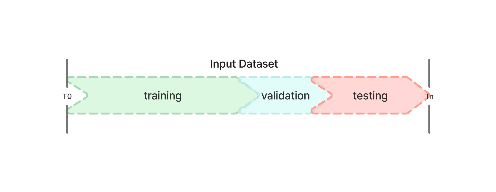

# Understanding Fraud Detection: Beyond Time Series to Circular Patterns
Let's be real - if you're working on fraud detection, you've probably tried to treat it as a time series problem at some point. We've all been there. But here's the thing: fraud patterns don't follow a nice, neat timeline. They're more like a carousel - patterns keep coming back around, but each time they're a bit different. Let's dive into why traditional time series approaches fall short and how to build better fraud detection systems.

## Introduction
In the realm of fraud detection, a common misconception persists: treating fraud as a pure time series phenomenon. While temporal aspects play a crucial role, the reality is far more nuanced. Fraud patterns exhibit what we might call a "circular" nature, where patterns resurface with variations, rather than following strict temporal progression.

## The Circular Nature of Fraud
Imagine a carousel rather than a straight timeline. Fraudsters often revisit successful techniques, adapting and refining them. For instance, holiday season fraud patterns may repeat annually, but with sophisticated variations that reflect learned experiences from both sides - fraudsters and detection systems.

## Why Not Pure Time Series?
A time series is a sequence of data points collected or recorded at regular time intervals, where each observation is dependent on its temporal position. In traditional time series analysis, we assume that:
1. Future events are directly dependent on past events
2. Patterns follow a consistent temporal progression
3. Seasonality and trends are predictable

However, fraud doesn't strictly adhere to these principles. While a customer's past behavior might indicate fraud risk, we cannot definitively say that all previous events directly cause subsequent ones. Fraudsters are adaptive, creating an ever-evolving landscape of patterns.

## Building Robust Fraud Detection Models

### Data Preparation: The Foundation

When it comes to fraud detection, time isn't just a dimension - it's the key to understanding how fraud patterns evolve. Let's tackle this in two steps:

First, we need to build features that capture the temporal nature of fraud. This means creating features that can spot when behavior patterns start to shift over time. But here's where it gets tricky - you need to be super careful about not accidentally using future information to predict the past (we call this data leakage). Want to learn more about this? Check out my [feature_engineering.md] article.

Then we need to focus on data splitting. Remember that carousel we talked about? We need to split our data in a way that captures both the circular nature of fraud patterns and their evolution over time. Let me show you how to do this right.

Consider these critical aspects:

**1. Training Window Selection**
* Historical Depth: Capture enough history to understand pattern variations
* Recency Balance: Include recent data to reflect current tactics
* Labels Maturity: Remember to consider a buffer for your labels to be mature (e.g. do not take the most recent month, go back at least 60 days)
* Optimal Window: Usually 6-12 months, depending on fraud velocity

**2. Validation Split in Fraud Detection: The Two-Pronged Approach**
In fraud detection, the traditional split of data into training, validation, and test sets requires special consideration due to the temporal nature of fraud patterns and the need to prevent data leakage. More on this in the following section

## Validation Split
__what does it serve for__
 
>Training: Model development\
>Validation: Model selection & hyperparameter tuning\
>Test: Final performance evaluation

### standard validation split
The most common structure used for timeseries events maintains temporal ordering and has no random splitting across time periods:
- 
>Timeline:\
>[Training Set (60%)] -> [Validation Set (20%)] -> [Test Set (20%)]

* Example: For 1 year of data
>Training: Jan-Jul\
>Validation: Aug-Sep\
>Test: Oct-Dec




### Validation Split in Fraud Detection: The Two-Pronged Approach


* Out-of-Time (OOT) Validation
An out of time set (oot) that the model has never seen (in the future wrt training set)
>Training Data (Jan-Jun) --> Future Data (Jul-Sep)\
>Purpose: Test model robustness against new patterns

__Example code__

```python 
_expression = "trans_date_trans_time < '2020-07-01 00:00:00'"
train = data.query(_expression)

oot = data.query(f"~({_expression})")
oot_y = oot.is_fraud
oot_X = oot.drop(columns=['is_fraud'])
```

* In-Time Holdout
A validation set sampled from the training population. This serves to test that the model is able to generalize between what it has already seen. For simplicity, I prefer calling this set Holdout to avoid confusion with out-of-time validation set and cross-validation test set.

>Training Data (e.g., Jan-Jun) --> Random Validation Sample\
>Purpose: Test pattern generalization within known timeframe

__Example code__

```python 
X = train.drop(columns=['is_fraud'])
X.drop(metadata_columns, axis=1, inplace=True)
y = train['is_fraud']

train_X, holdout_X, train_y, holdout_y = train_test_split(X, y, test_size=0.2, random_state=42)
```

## Validation Checks
__Volume Check__
* Ensure sufficient fraud cases in each split
* Maintain class distribution across splits

__Pattern Verification__
* Check for pattern stability across splits
* Verify business cycle representation

```python 
def validate_split(train, val, test):
    """
    Verify split quality
    """
    checks = {
        "Size Ratios": check_size_distribution(train, val, test),
        "Class Distribution": check_class_distribution(train, val, test),
        "Temporal Order": verify_temporal_order(train, val, test),
        "No Overlap": verify_no_overlap(train, val, test)
    }
    return checks
```

