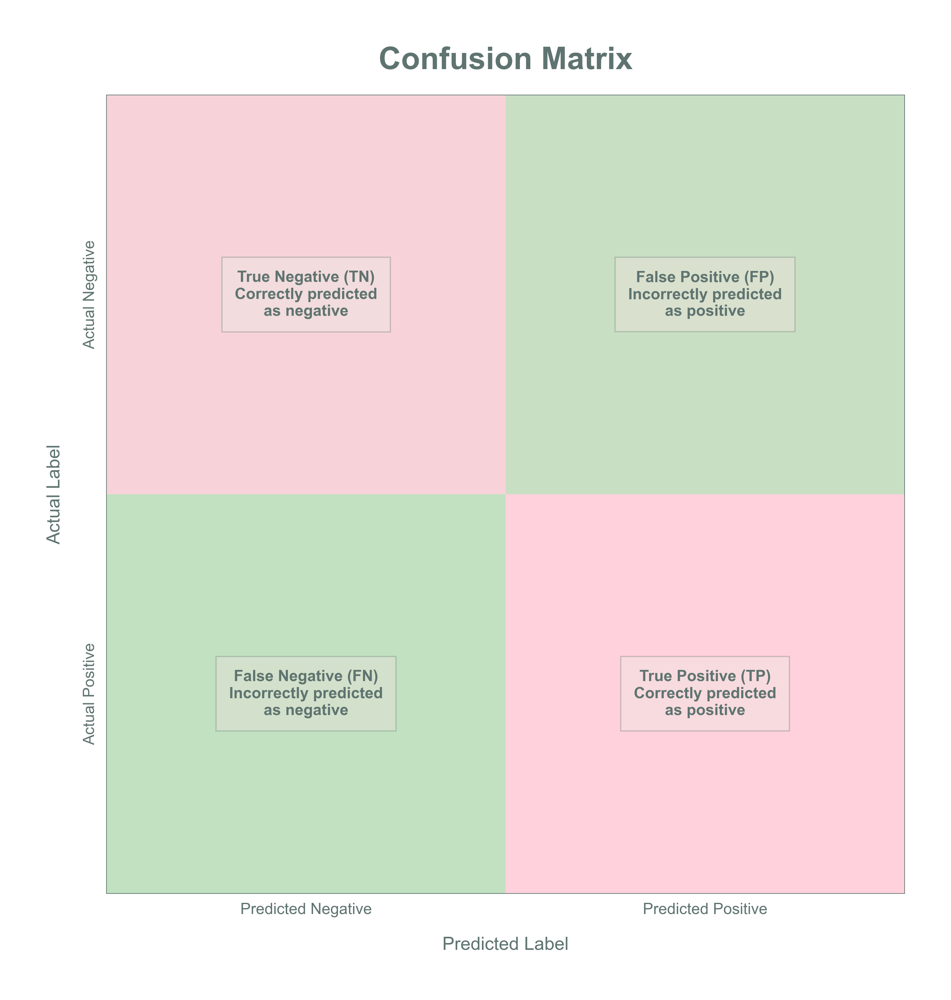
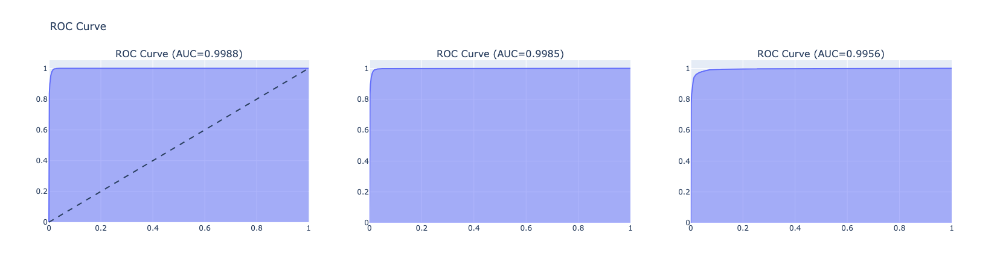
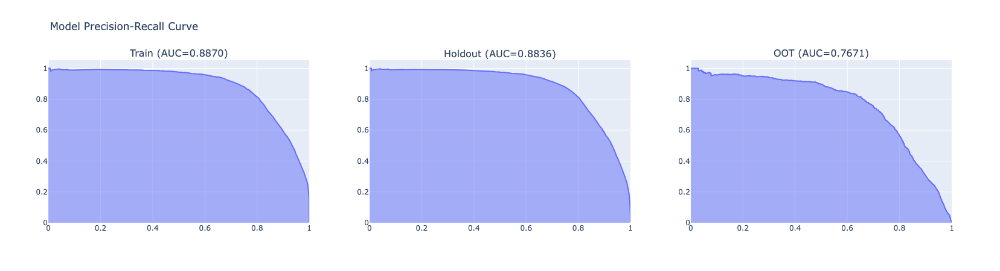
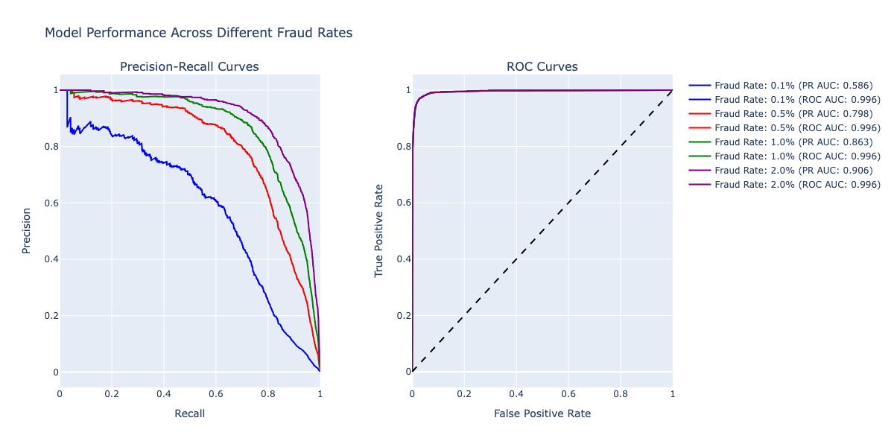
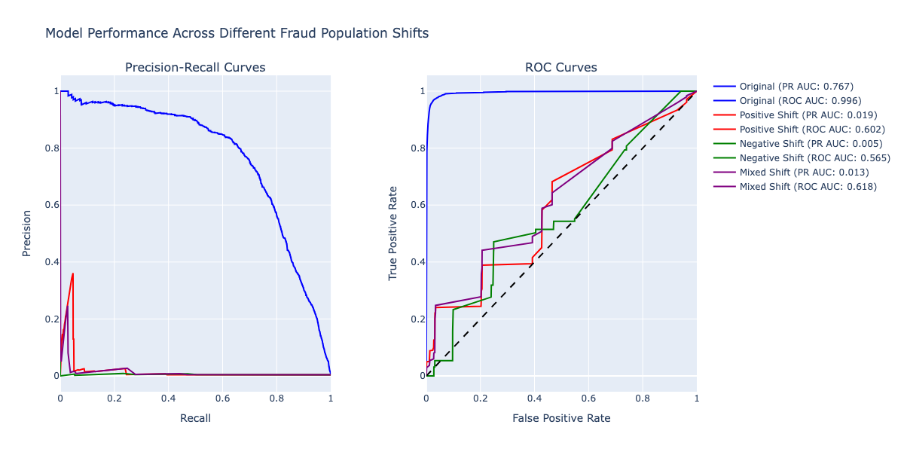
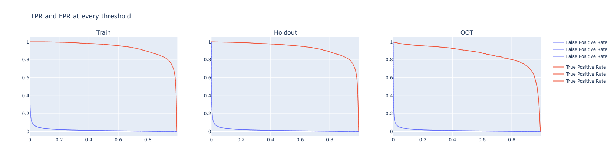

# Understanding Model Stability Metrics in Fraud Detection: Beyond Accuracy

In the realm of fraud detection, choosing the right metrics to evaluate model performance is crucial. This article delves into various evaluation metrics, their significance in unbalanced datasets, and how they behave under different fraud scenarios.

## The Challenge of Unbalanced Datasets

Fraud detection presents a unique challenge: the vast majority of transactions are legitimate, while fraudulent transactions are rare. This imbalance makes traditional accuracy metrics misleading. Let's understand why through a practical example.

### Beyond Accuracy: Precision, Recall, and F1 Score

The confusion matrix above illustrates the fundamental components of model evaluation:
- **True Positives (TP)**: Correctly identified fraud cases
- **False Positives (FP)**: Legitimate transactions incorrectly flagged as fraud
- **True Negatives (TN)**: Correctly identified legitimate transactions
- **False Negatives (FN)**: Missed fraud cases

In an unbalanced dataset where fraud might represent only 1% of transactions:
- A naive model that predicts "legitimate" for everything would achieve 99% accuracy
- Yet, it would be useless for fraud detection (0% fraud detection rate)

This is why we use more nuanced metrics:
- **Precision**: TP / (TP + FP) - Of all transactions we flag as fraud, what percentage are actually fraud?
- **Recall**: TP / (TP + FN) - Of all actual fraud cases, what percentage do we catch?
- **F1 Score**: Harmonic mean of precision and recall, balancing both metrics

### Real-World Example: Our Model's Performance

Let's look at how these metrics manifest in our actual fraud detection model across different datasets:

| Metric    | Train    | Holdout  | OOT      |
|-----------|----------|----------|----------|
| Accuracy  | 98.97%   | 98.98%   | 99.15%   |
| Precision | 35.85%   | 35.62%   | 29.74%   |
| Recall    | 97.19%   | 96.61%   | 90.36%   |
| F1 Score  | 52.38%   | 52.05%   | 44.76%   |

This data perfectly illustrates why accuracy alone is misleading:
1. **High Accuracy (98-99%)**: Looks impressive but doesn't tell the whole story
2. **Moderate Precision (29-36%)**: Shows that about 1/3 of our fraud alerts are actual fraud
3. **High Recall (90-97%)**: Indicates we're catching most of the actual fraud cases
4. **Moderate F1 Score (44-52%)**: Reflects the trade-off between precision and recall

The slight degradation in performance from train to OOT (Out-of-Time) data is also worth noting, particularly in the precision and recall metrics, highlighting the importance of continuous model monitoring.

## ROC-AUC vs PR-AUC: Which to Choose?

**General Notions**

The PR-AUC plots provide a more realistic picture of model performance in fraud detection scenarios, as they better capture the challenges of detecting rare fraudulent transactions while maintaining reasonable precision. This is particularly important in fraud detection where both false positives (blocking legitimate transactions) and false negatives (missing fraud) have significant business implications.

In details:

ROC AUC plots can be misleading in highly imbalanced datasets because:
* They show the trade-off between True Positive Rate (TPR) and False Positive Rate (FPR): a model can achieve high ROC AUC by simply predicting the majority class
* The ROC curve might look good even when the model is not performing well on the minority class
* Therefore, ROC plot is less sensitive to class imbalance and might lead to optimistic considerations
* It gives no insight on the capability of the model to detect rare events

PR AUC plots are more informative because:
* They show the trade-off between Precision and Recall, therefore focusing on the positive class (fraudulent transactions)
* They better reflect the model's ability to handle the minority class, providing a clearer picture of the model's practical utility
* They are more sensitive to improvements in fraud detection capabilities

### Receiver Operating Characteristic (ROC) Curve

The ROC curve plots the True Positive Rate (TPR) against the False Positive Rate (FPR) across different threshold values. While widely used, ROC curves can be misleading in highly imbalanced datasets.

### Precision-Recall (PR) Curve

The PR curve is often more informative for fraud detection because:
- It focuses on the minority class (fraud)
- It's more sensitive to changes in the number of false positives
- It better reflects the business impact of false positives

### Commenting our Plots

Looking at the model performance across different datasets:
- The PR-AUC shows that the model is overfitting
- The ROC-AUC gives a stable very high performance (around 0.99)
- The significant 0.4 drop of PR from Training to Out-of-Time (OOT) indicates:
  - Poor generalization to new data
  - A struggle to maintain precision while keeping recall high
  - All indicators of overfitting

### Best Practices for Fraud Detection:

* Use PR-AUC as the primary evaluation metric
* Monitor both precision and recall trade-offs
* Consider the business impact of false positives vs false negatives
* Implement proper sampling techniques within cross-validation folds
* Use stratified cross-validation to maintain class distribution

## ROC and PR curves after production

The importance of using PR curves over ROC curves extends beyond initial model evaluation - it's crucial for monitoring model stability in production. While ROC curves might suggest stable performance, they can mask significant issues that PR curves clearly reveal.

### Why ROC Curves Can Be Deceptive in Production

ROC curves can remain stable even when the model's real-world performance degrades significantly. This is particularly evident in two common scenarios:

1. **Changing Fraud Rates**
   - ROC curves might show stable performance even as fraud rates change
   - This stability is misleading because it doesn't reflect the actual impact on business operations
   - PR curves, on the other hand, clearly show how the model's precision and recall are affected

2. **Population Drift**
   - When fraud patterns change but overall fraud rates remain similar
   - ROC curves might maintain their shape, suggesting stable performance
   - PR curves reveal the true impact on the model's ability to detect new fraud patterns

#### Model Performance Across Different Fraud Rates

We analyzed how our model performs under different fraud rates:
- Original fraud rate (baseline)
- 2x fraud rate
- 4x fraud rate
- 8x fraud rate

Key findings:
1. ROC curves remain relatively stable across different fraud rates
2. PR curves show more significant changes, reflecting their sensitivity to class imbalance
3. Higher fraud rates generally lead to better PR-AUC scores, but this might not reflect real-world performance

#### Impact of Drifting Fraud Patterns

Fraudsters constantly adapt their strategies, making it crucial to monitor how our model performs when fraud patterns change. This is another scenario where PR curves prove invaluable for production monitoring.

We simulated real-world drift scenarios by creating different versions of our fraud population:
1. Original patterns (baseline)
2. Positive shift (increasing feature values)
3. Negative shift (decreasing feature values)
4. Mixed shift (random direction per feature)

Our analysis reveals:
- Model performance varies significantly with shifting fraud patterns
- Some shifts are more challenging to detect than others
- Regular model retraining and monitoring are crucial

### The Role of PR Curves in Production Monitoring

PR curves are particularly valuable for production monitoring because they:
- Provide early warning signs of model degradation
- Help identify when retraining is necessary
- Give clear insights into the model's ability to detect new fraud patterns
- Better reflect the business impact of model changes

## True Positive Rate vs False Positive Rate Trade-off

In fraud detection, there's always a trade-off between:
- Catching more fraud (higher TPR)
- Minimizing false alarms (lower FPR)

The optimal operating point depends on business factors:
- Cost of investigating false positives
- Cost of missing fraud
- Customer experience impact
- Regulatory requirements

## Key Takeaways

1. **Don't Trust Accuracy Alone**: In unbalanced datasets, accuracy can be misleading. Use precision, recall, and F1 score.

2. **PR Curves > ROC Curves**: For fraud detection, PR curves and PR-AUC provide more meaningful insights than ROC curves.

3. **Monitor Performance Changes**: Both fraud rates and patterns change over time. Regular monitoring using appropriate metrics is crucial.

4. **Consider Business Context**: Choose operating thresholds based on business constraints and costs, not just mathematical optimization.

## Conclusion

Effective fraud detection requires understanding both the strengths and limitations of different evaluation metrics. By choosing the right metrics and understanding how they behave under different scenarios, we can better evaluate and improve our fraud detection models.

Remember: The goal isn't just to optimize a metric, but to build a robust system that effectively fights fraud while maintaining a good customer experience. 